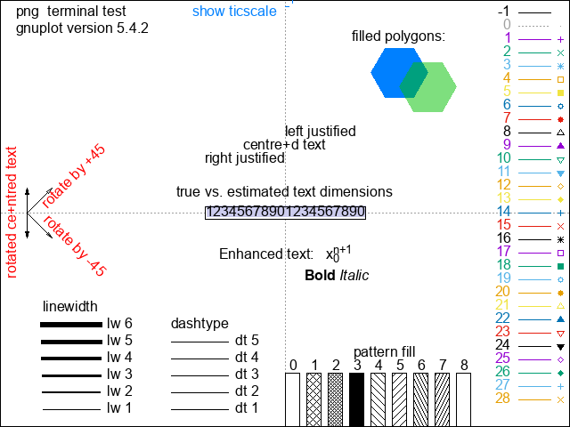
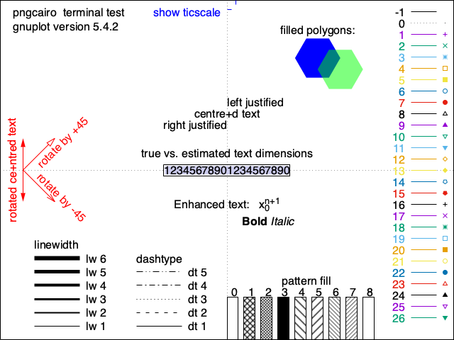
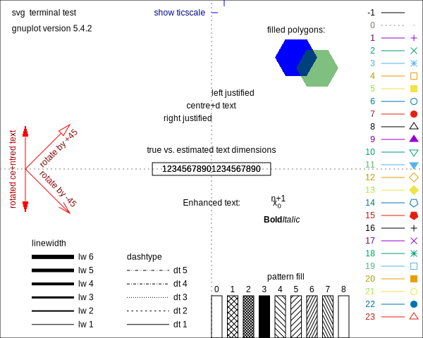
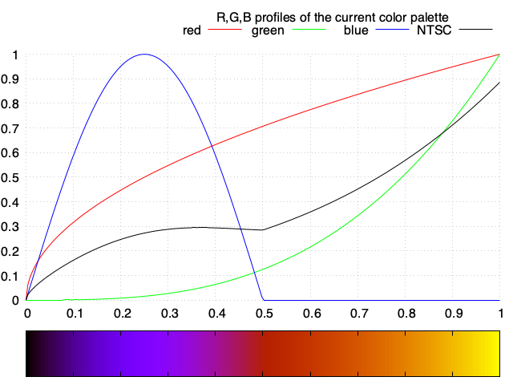
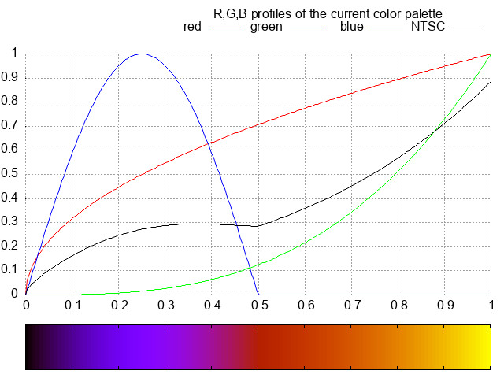
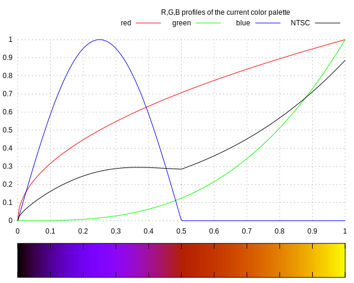
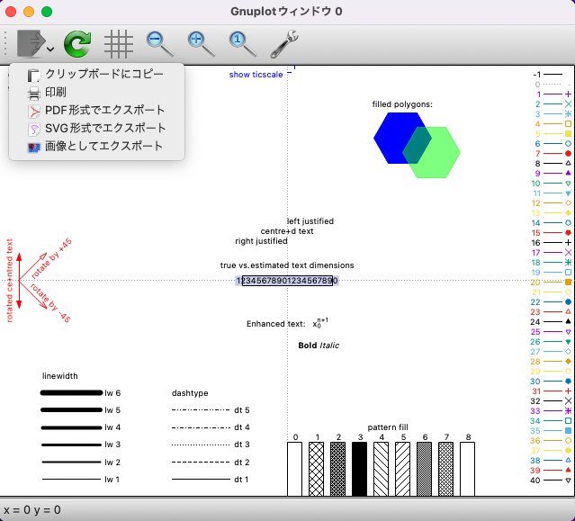

# Generate Samples in 9 Terminals
This gnuplot script generates samples in 9 terminals.　
- qt
- png
- pngcairo
- jpeg
- gif
- svg
- postscript
- epscairo
- pdfcairo

In `qt` terminal, the sample will be displayed on the 'qt' window.
In the other terminals, this script will automatically output sample images and save them in a folder (terminal / palette).

## Documents
The details of the script and comparison of the outputted samples are documented in my blog.
My blog is written in Japanese, but you can translate it in your language by GTranslate.  
- [Japanese (original)](https://hiroloquy.com/2020/09/03/gnuplot_compare_9_terminals/)
- [English (auto translated)](https://hiroloquy-com.translate.goog/2020/09/03/gnuplot_compare_9_terminals/?_x_tr_sl=ja&_x_tr_tl=en&_x_tr_hl=ja&_x_tr_pto=wapp)


## Images (Excerpt)
### Test terminal
|||||
|:---:|:---:|:---:|:---:|
|**png**|**pngcairo**|**jpeg**|**svg**|

### Test palette
|||||
|:---:|:---:|:---:|:---:|
|**png**|**pngcairo**|**jpeg**|**svg**|

<!-- ## Features -->
<!-- # Operating environment -->
## Requirement
- macOS Catalina 10.15.6, Monterey 12.1 / Macbook Air (M1, 2020)
- gnuplot version 5.4 patchlevel 2

<!-- # Installation -->
 
## Usage
```sh
git clone https://github.com/hiroloquy/generate-samples-in-9-terminals.git
cd generate-samples-in-9-terminals
gnuplot
load 'test_in_various_terminal_type.plt'
```

## Note
If you want to output the test sample in **`qt`** terminal , click the icon at the top left of the window and select the file format.
||
|:---:|
|**qt window (in Japanese)**|

## Author
* Hiro Shigeyoshi
* Twitter: [@hiroloquy](https://twitter.com/hiroloquy)

## License
"generate-samples-in-9-terminals" is under [MIT license](https://github.com/hiroloquy/generate-samples-in-9-terminals/blob/main/LICENSE).
 
